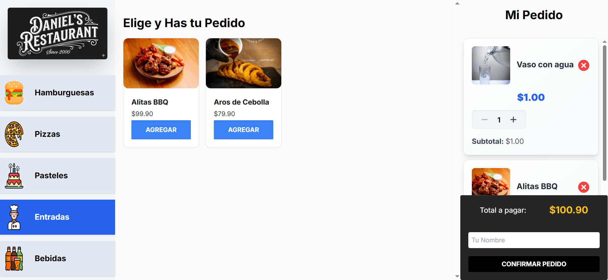
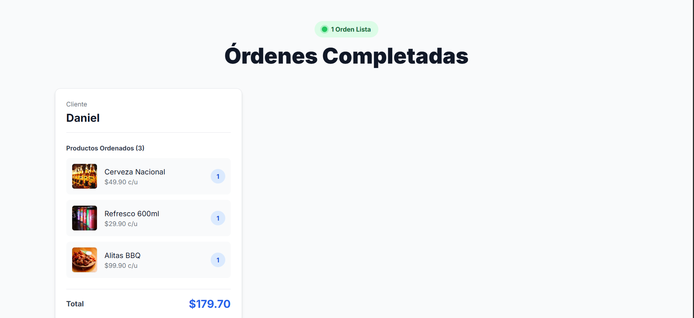
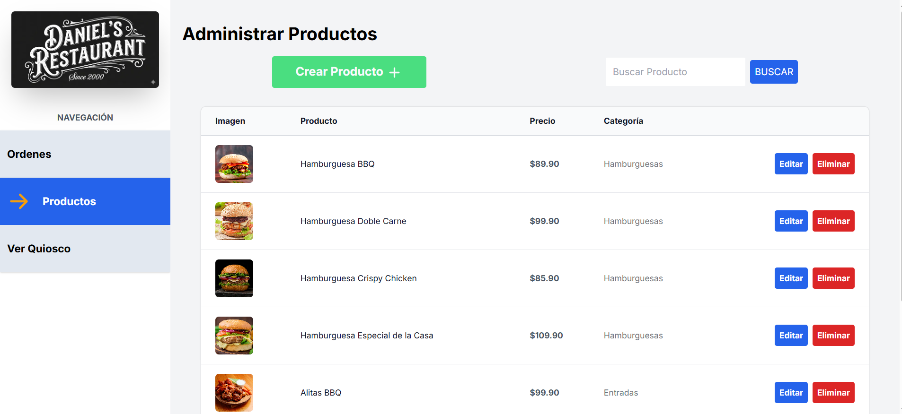

# 🍽️ Daniel's Restaurant — Food Kiosk

A full stack restaurant management system with multiple views: a customer-facing kiosk for placing orders, a kitchen display to manage incoming orders in real time, and an admin panel for product and inventory management.

🔗 **Live Demo:** [restaurante-next-lac.vercel.app](https://restaurante-next-lac.vercel.app/admin/products)

---

## 📸 Screenshots

### 🛒 Customer Kiosk
Customers browse the menu by category, add items to their order, and confirm with their name.



### 🍳 Kitchen Display
The kitchen sees incoming orders in real time and marks them as completed.



### ⚙️ Admin Panel
Admins can create, edit, and delete products with images and categories.



---

## 🚀 Tech Stack

- **Framework:** Next.js 14 (App Router)
- **Database:** PostgreSQL + Prisma ORM
- **State Management:** Zustand
- **Data Fetching:** SWR
- **Validation:** Zod
- **Image Storage:** Cloudinary
- **Styling:** Tailwind CSS
- **Language:** TypeScript

---

## ✨ Features

- 🗂️ Product catalog organized by categories
- 🛒 Customer kiosk for self-service ordering
- 🍳 Kitchen display with real-time order updates
- ⚙️ Admin panel to create, edit, and delete products
- ☁️ Image upload via Cloudinary
- ✅ Server-side validation with Zod

---

## 🛠️ Getting Started

### Prerequisites

- Node.js 18+
- PostgreSQL database
- Cloudinary account

### Installation

```bash
# Clone the repo
git clone https://github.com/dany99222/restaurante-next.git
cd restaurante-next

# Install dependencies
npm install

# Set up environment variables
cp .env.example .env
# Fill in your DATABASE_URL and Cloudinary credentials

# Run database migrations
npx prisma migrate dev

# Start the development server
npm run dev
```

Open [http://localhost:3000](http://localhost:3000) to see the app.

### Environment Variables

```env
DATABASE_URL=your_postgresql_connection_string
NEXT_PUBLIC_CLOUDINARY_CLOUD_NAME=your_cloud_name
CLOUDINARY_API_KEY=your_api_key
CLOUDINARY_API_SECRET=your_api_secret
```

---

## 📁 Project Structure

```
/actions        → Server actions (Next.js)
/app            → Routes and pages
/components     → Reusable UI components
/prisma         → Database schema & migrations
/public         → Static assets
/src
  /generated    → Prisma generated client
  /lib          → Utilities and helpers
  /schema       → Zod validation schemas
  /store        → Zustand global state
  /types        → TypeScript types
  /utils        → Helper functions
```

---

## 👤 Author

**Luis Daniel Villalpando Hurtado**
- GitHub: [@dany99222](https://github.com/dany99222)
- LinkedIn: [luisdanielvillalpandohurtado](https://linkedin.com/in/luisdanielvillalpandohurtado/)
